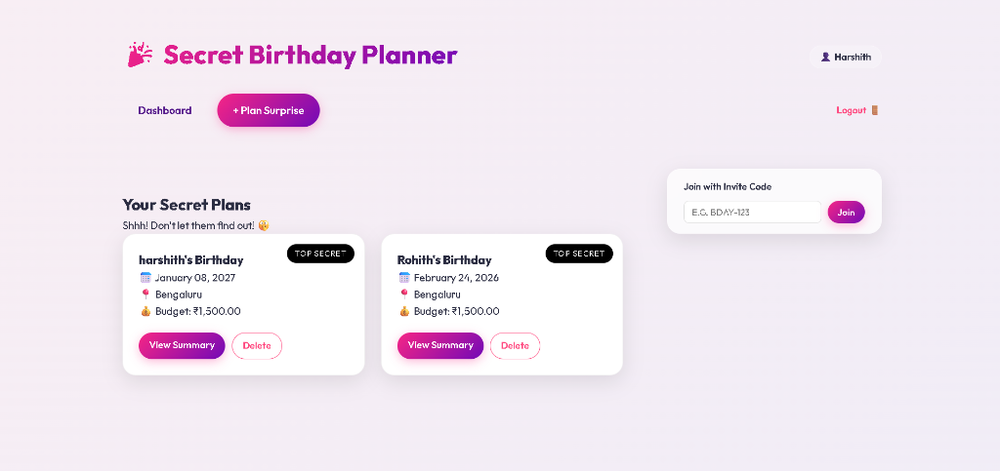
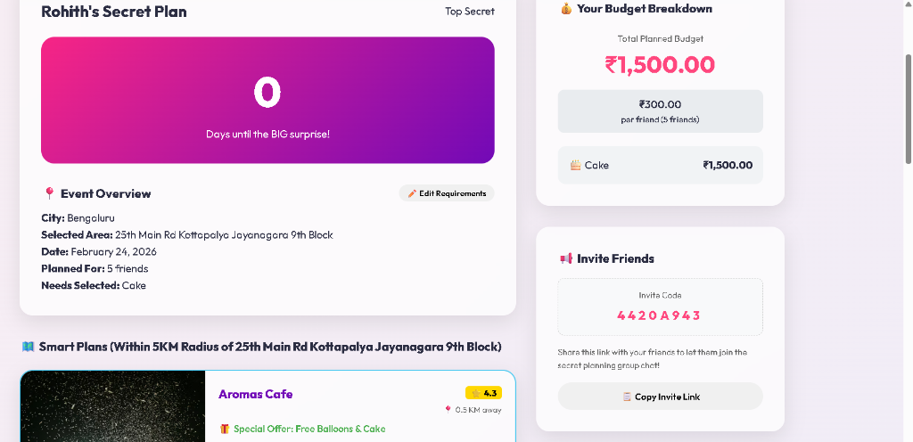
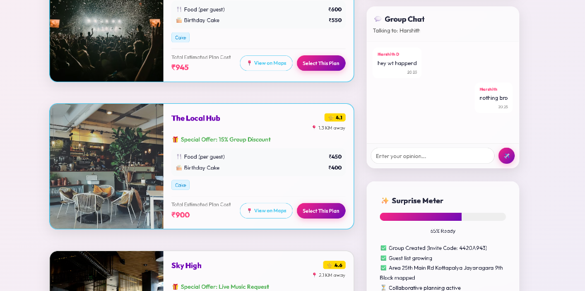
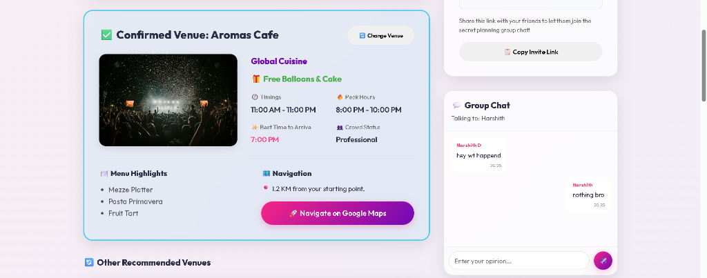

# Secret Birthday Planner 🎉 🤫

A premium, full-stack web application designed for planning perfect surprise birthday parties. It combines smart discovery, collaborative group planning, and secure access to ensure the surprise remains a secret!

## 🌟 Visual Showcase

### 1. Dashboard & Event Management
Overview of all your secret birthday plans in one place.


### 2. Event Overview & Countdown
Track the days remaining and manage specific party requirements.


### 3. Collaborative Planning & Live Chat
Discuss ideas with friends and see real-time "Surprise Meter" progress.


### 4. Confirmed Itinerary & Final Details
The final result with confirmed venue, timings, menu highlights, and crowd status.


---

## 🚀 Key Features

### 🔐 Secure & Private
- **Personal Accounts**: Access your private dashboard using your Name and a Unique PIN.
- **Selective Visibility**: Only creators can manage their birthday plans.
- **Top Secret Mode**: Visual indicators for highly sensitive surprises.

### 👥 Collaborative Group Planning
- **Invite Links & Codes**: Generate unique codes (e.g., `BDAY-123X`) to invite friends.
- **Real-time Group Chat**: Integrated chat panel for friends to discuss ideas and finalize plans together.
- **Dynamic Guest Lists**: Friends can join the group by contributing names and participating in the live chat.
- **Live Editing**: On-the-fly updates for party requirements, location, and guest counts that update for everyone.

### 🧠 Smart Venue Discovery
- **Location-Aware Search**: Targeted venue discovery within a **5KM radius** of specific neighborhoods.
- **Automated Budgeting**: Dynamic budget distribution for Cake, Food, and Decor based on selected needs.
- **Maps Integration**: One-click "View on Maps" buttons for every venue suggestion.
- **Deep Venue Details**: Real-time ratings, prices, timings, and crowd level status to make informed decisions.

### 🎨 Premium Experience
- **Modern Aesthetics**: Sleek glassmorphic UI with vibrant gradients and interactive elements.
- **Countdown Tracking**: Visual timers leading up to the big event.
- **Surprise Meter**: Interactive progress tracking for the completion of the party plan.

## 🛠️ Tech Stack
- **Backend**: Python Flask
- **Database**: PostgreSQL (Neon DB) with SQLAlchemy ORM
- **Frontend**: HTML5, Vanilla CSS3, JavaScript
- **API Simulation**: Discovery Service for real-time venue and itinerary data

## ⚙️ Setup Instructions

1. **Clone or Download** the project.
2. **Install Dependencies**:
   ```bash
   pip install -r requirements.txt
   ```
3. **Configure Environment**:
   Ensure you have a `.env` file with:
   ```env
   DATABASE_URL=your_postgresql_url
   SECRET_KEY=your_secret_key
   ```
4. **Run the App**:
   ```bash
   python app.py
   ```
5. **Start Planning**:
   Go to `http://127.0.0.1:5000` and create your first secret account!

---
Developed with ❤️ for perfect birthday surprises!
Check out [HOW_IT_WORKS.md](HOW_IT_WORKS.md) for a deep dive into the logic.
